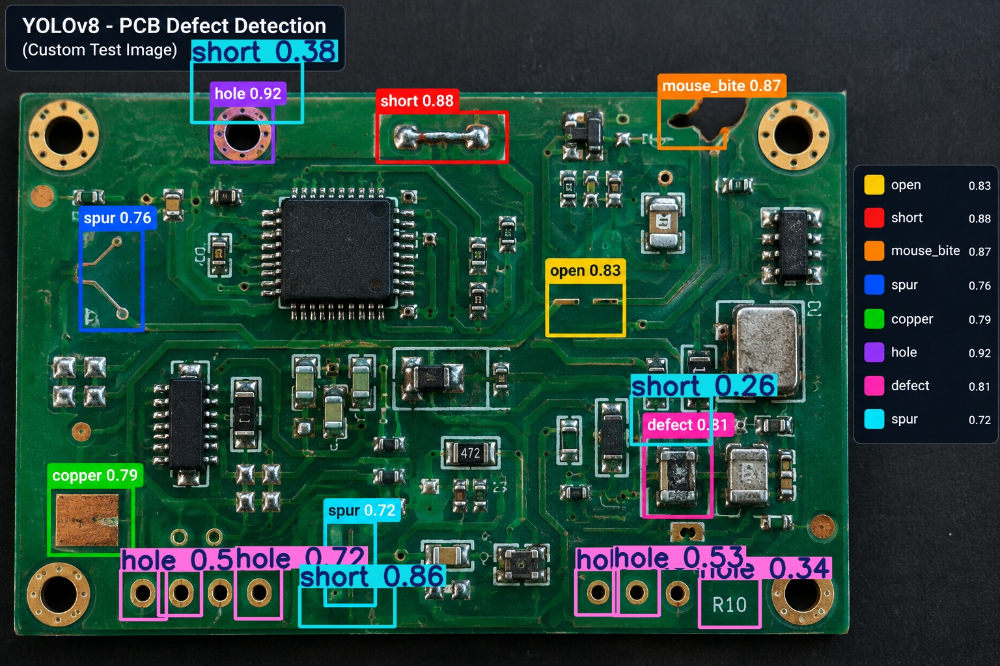

# AI-Based PCB Defect Detection

An AI-based PCB defect detection system developed using **YOLOv8** and deep learning to automatically identify defects in Printed Circuit Boards (PCBs).

## 📌 Project Overview

Manual PCB inspection can be time-consuming and may miss small defects. This project uses a trained YOLOv8 object detection model to detect PCB defects from an input image.

## 🚀 Features

* AI-based PCB inspection
* YOLOv8 object detection
* Automatic defect localization using bounding boxes
* Fast image inference
* Detection result visualization

## 🔍 Defect Classes

The model is trained to detect PCB defect categories including:

* Open
* Short
* Mouse Bite
* Spur
* Copper
* Hole

## 🧠 Model

**Model:** YOLOv8
**Dataset:** DeepPCB
**Framework:** Ultralytics
**Language:** Python

## 🧪 Test Result

The trained model was tested using a PCB image.

The test image successfully detected:

* **3 Shorts**
* **6 Holes**

### Detection Result



## 🛠️ Technologies Used

* Python
* YOLOv8
* Ultralytics
* PyTorch
* OpenCV
* Deep Learning

## 📂 Project Files

```text
AI-Based-PCB-Defect-Detection/
├── README.md
├── requirements.txt
├── best.pt
├── detect.py
└── YOLOv8_PCB_Defect_Detection.jpg
```

## ▶️ How to Run

Install the required dependencies:

```bash
pip install -r requirements.txt
```

Run the detection script:

```bash
python detect.py
```

## 🎯 Applications

* Automated PCB inspection
* Electronics manufacturing
* Quality control
* Defect identification
* Smart manufacturing systems

## 👨‍💻 Author

**Gowtham S**

B.E. Electronics and Communication Engineering
